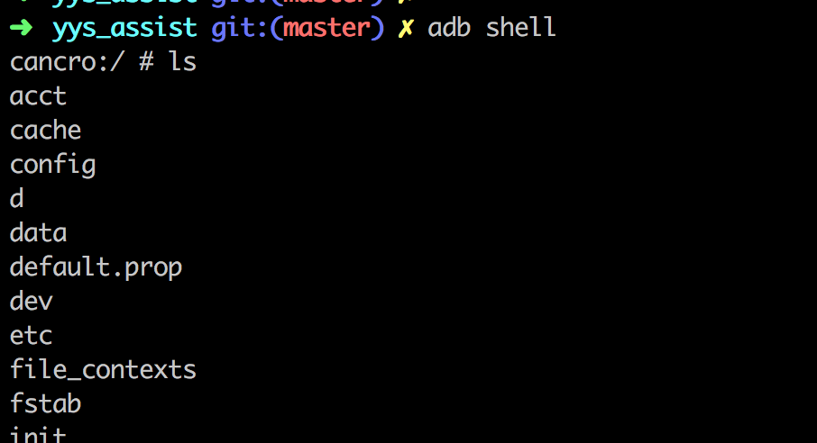

# yys_assist
基于Android adb的一个阴阳师挂机魂10辅助(打手模式)。

## 环境
- 语言：python3.6
- 模拟器：网易mumu模拟器
- 其他：Android adb工具

## 使用流程
### 1. 确认adb 可以连接到模拟器


### 2. 在模拟器中进入阴阳师


### 3. 启动脚本
``` 
python3 simple_yys_assist.py
```
